# 系统LLM助理-ModelSynergy

- [系统LLM助理-ModelSynergy](#系统llm助理-modelsynergy)
  - [项目简介](#项目简介)
    - [项目内容简介](#项目内容简介)
    - [预期目标](#预期目标)
  - [项目背景调研](#项目背景调研)
  - [技术路线](#技术路线)
    - [InfLLM](#infllm)
    - [KVcache](#kvcache)
    - [实时监控与更新](#实时监控与更新)
      - [文件修改监视](#文件修改监视)
      - [消息队列](#消息队列)
      - [扩展属性](#扩展属性)
  - [实现效果展示](#实现效果展示)
    - [KVcache加速与实时监控](#kvcache加速与实时监控)
    - [信息检索](#信息检索)
    - [长上下文效果](#长上下文效果)
  - [实现结果分析](#实现结果分析)
  - [总结与展望](#总结与展望)
    - [工作进展与分工](#工作进展与分工)
    - [不足](#不足)
    - [未来展望](#未来展望)
  - [鸣谢](#鸣谢)
  - [参考文献与相关链接](#参考文献与相关链接)

## 项目简介

### 项目内容简介

**基于`InfLLM`长上下文技术，结合`KVcache`加速推理过程，通过下端引入`open-interpreter`技术使得模型基于本地操作系统的用户内容，生成用户个性化的，更细粒度符合用户操作习惯、需求的命令，将LLM作为Agent引入操作系统，增强操作系统的用户友好性，使得操作系统更加自动化、智能化。**
本项目的重点在于如何将LLM与操作系统耦合，使得其在内核与用户间提供一个更用户友好的、更便于操作的中间层。

### 预期目标

我们将LLM的上下文机制引入操作系统，希望使得操作系统的文件系统等成为上下文的组成部分，提高LLM对用户的个性化适用性。并且希望通过KVcache的引入，加速推理过程使得相应速度提高，更符合用户需求，实时监控文件系统更改，修改KVcache，并引入interpreter等工具生成操作命令，对用户更友好，更易操作。

## 项目背景调研

- 近来，由Andrej Karpathy提出的**LLM OS**提供了一种将LLM引入操作系统的新思路
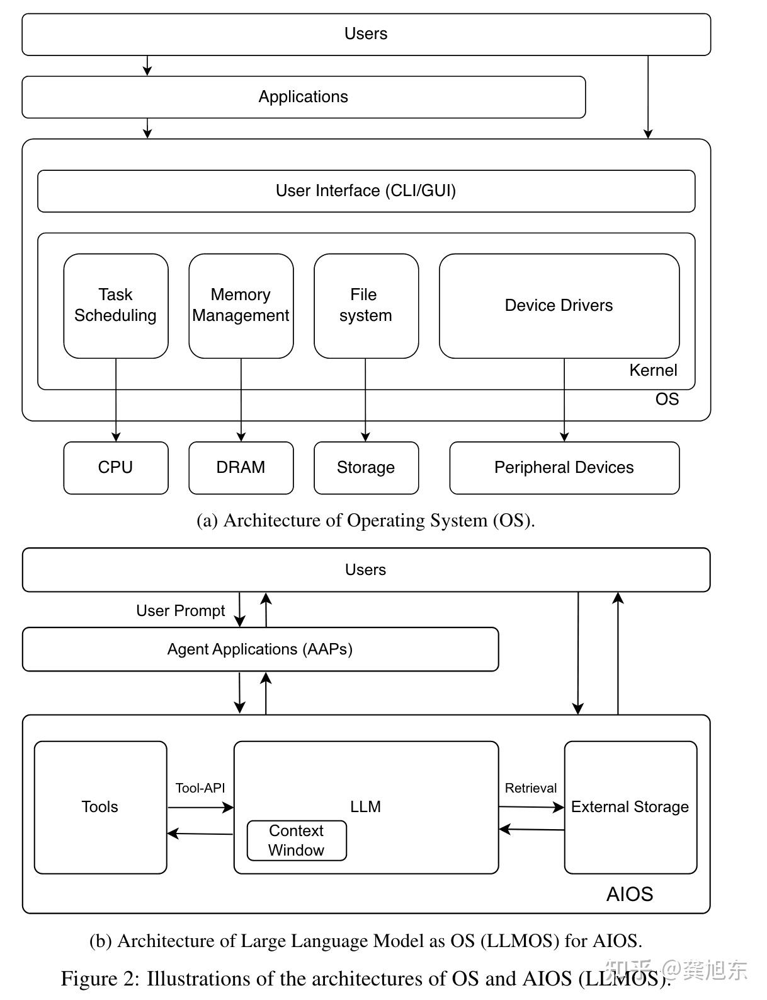

- **AIOS则提出了一种将`Agent`类比为app，LLM类比为`OS kernel`的新系统**

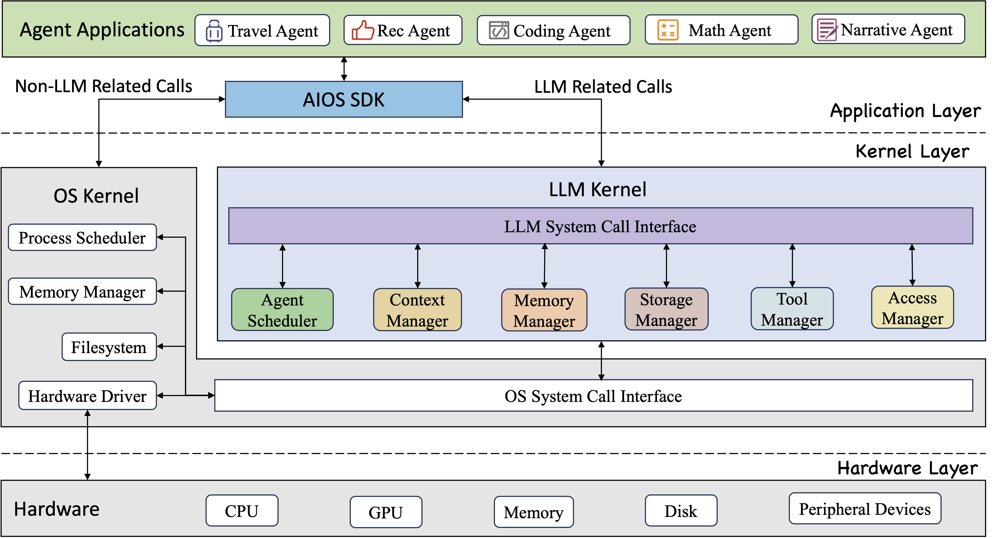

**Apple 发布面向 iPhone、iPad 和 Mac 的个人智能化系统 Apple Intelligence，基于个人场景发挥生成式模型的强大功用，结合用户情况提供有助益且相关的智能化功能。** Apple Intelligence 深度集成于 iOS 18、iPadOS 18 和 macOS Sequoia 中，充分运用 Apple 芯片对语言和图像的理解与创作能力，可做出多种跨 app 操作，同时结合个人场景，为用户简化和加快日常任务流程。通过 Private Cloud Compute，Apple 为 AI 的隐私功能树立了全新标准，并能在设备端进程和搭载 Apple 芯片的更大型、基于服务器的模型之间灵活配置和扩充计算资源。

苹果，百度等一系列公司在今年陆续推出基于AI的操作系统与系统助手，充分说明了系统集成AI的发展前景


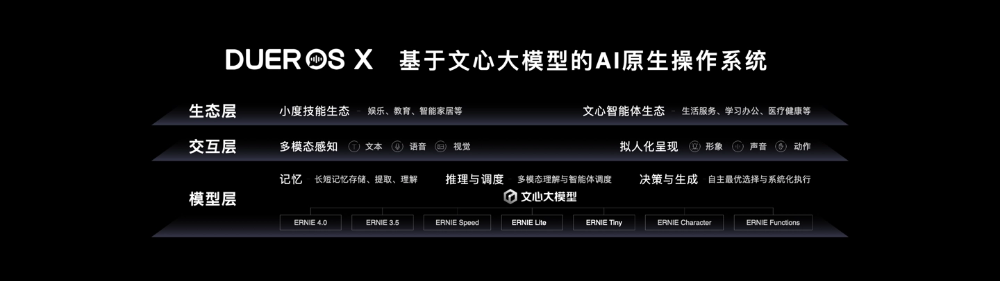

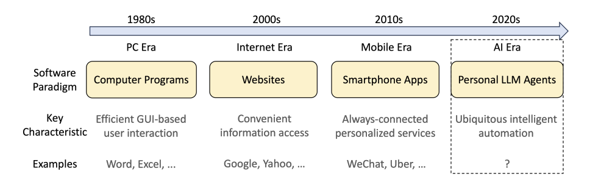

- 将个人LLM助理类比为程序、网页和APP也许并不恰当，但如果个人LLM助理确实能如同设想一样，从自然语言中获取指令，完成当前要在程序、网页和APP上经过繁琐的操作才能完成的操作，那么它带来的冲击将远超这三者。但是，个人LLM助理的软件堆栈和生态系统仍处于非常早期的阶段，相关领域的技术也还无法支持此项目。

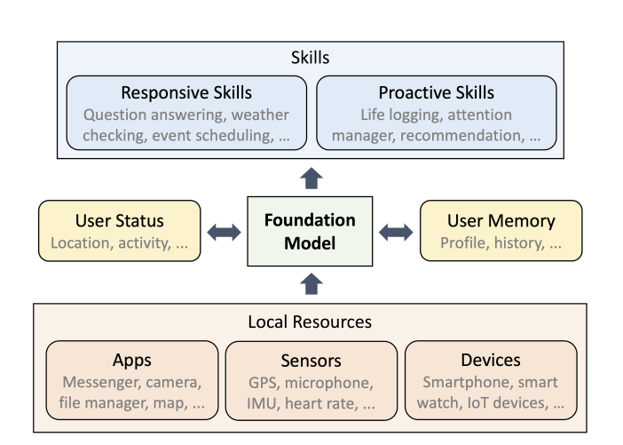

- 与操作系统类似，个人LLM助理同样是需要关联存储、I/O设备、软件、用户交互等各个领域的综合技术。因此，个人LLM助理不仅对LLM的文本理解、代码生成、决策等“本职工作”提出了更高的要求，而且涉及到一些LLM并没有针对性训练的能力，比如GUI理解、多模态呈现、任务调度、上下文选取、管理和利用内存等等。换一个角度来说，也许智能个人助理并不只是需要LLM，而是需要一种有着超强的学习、交互、处理、决策能力的新一代人工智能，只不过目前LLM比较有这种潜力。

## 技术路线

### InfLLM

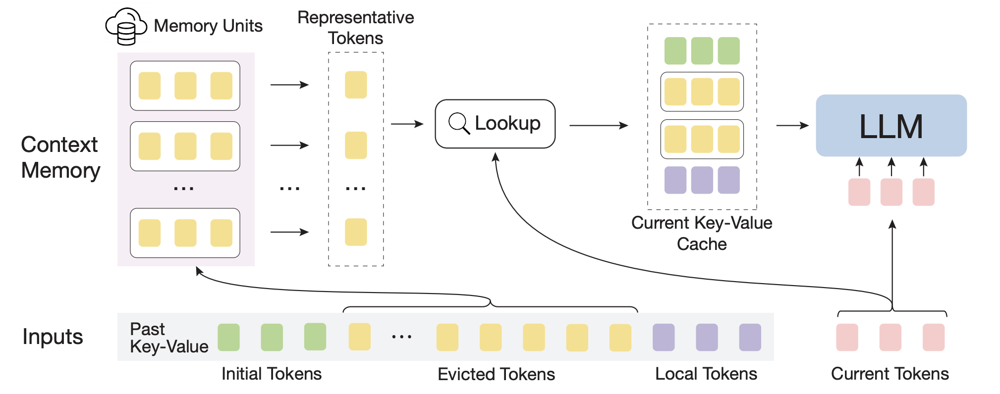

​在应用大语言模型时，上下文长度往往是提升模型能力的瓶颈。如在使用检索增强技术（RAG）时，模型会被要求利用若干篇文档，而这可能超出模型的上下文长度限制。在使用视频或者图片作为输入时也会产生大量的token 。对于一般的模型来说，超出上下文长度之后，困惑度会急剧上升，严重限制了模型的功能。早期的大语言模型的上下文长度限制很小，为4K tokens, 最新的模型可以达到1M tokens，然而仍然存在着上下文长度不足的问题。

​通过挖掘大模型固有的长文本理解能力，InfLLM在没有引入额外训练的情况下，利用一个外部记忆模块存储超长上下文信息，实现了上下文长度的扩展。

​为了让大模型能够记忆并处理更长的上下文，来自清华大学、麻省理工学院和人民大学的研究人员联合提出无需额外训练的大模型长文本理解方法 InfLLM，利用少量计算和显存开销实现了 LLM的超长文本处理。作者构建了一个外部记忆模块，用于存储超长上下文信息；采用滑动窗口机制，每个计算步骤，只有与当前Token距离相近的Tokens（Local Tokens）和外部记忆模块中的少量相关信息参与到注意力层的计算中，而忽略其他不相关的噪声。

### KVcache

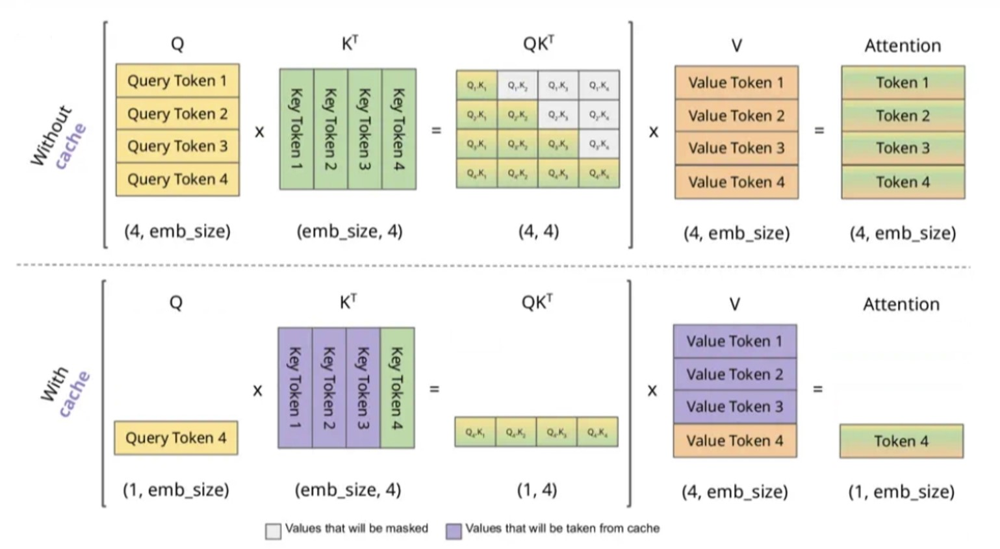

对于LLM类模型的一次推理（生成一个token）的过程，我们可以将这个过程分解为下列过程：

- 输入n个token $\{T_1, \cdots , T_i , \cdots , T_n\}$，每个token就是一个整数
- token预处理阶段，将token处理成token embedding $\{x_1^0,⋯,x_i^0,⋯,x_n^0\}$，每个token embedding就是一个向量，维度记为D。这里的上标0表示第0层，也就是输入。
- token embedding变换阶段，模型内部包含LLL层，每层的输入是token embedding，输出也是token embedding。最后一层输出的token embedding是$\{x_1^L,⋯,x_i^L,⋯,x_n^L\}$
- next token generation阶段，由最后一层的最后一个token embedding $x_n^L$，结合vocabulary embedding （一般也叫`lm_head`） $\{e_1,⋯,e_i,⋯,e_V\}$，生成每个token的概率$\{p_1,⋯,p_i,⋯,p_V\}$，再从这个概率分布中采样得到一个具体的token $T_{n+1}$。

当我们已经生成了一个token（即$T_{n+1}$），需要生成下一个token（即$T_{n+2}$）时，这两次生成的计算之间存在可以复用的部分：当输入token序列为$\{T_1,⋯,T_i,⋯,T_n,T_{n+1}\}$时，$x$ 与输入token序列为$\{T_1,⋯,T_i,⋯,T_n\}$的时候计算得到的结果是一样的，所以我们可以复用上一次计算的结果。

### 实时监控与更新

#### 文件修改监视

这一部分中，使用了Linux的`inotify` API来监视特定目录下文件修改事件。程序的核心功能是递归地为指定目录及其子目录下的所有文件和目录添加监视，然后循环等待事件发生，并对修改事件进行处理。下面是程序的主要步骤和组件：

- **初始化inotify和哈希表：**

使用inotify_init()初始化inotify实例，返回一个文件描述符fd，用于后续的监视操作；初始化两个哈希表wd_to_path和file_event_times。wd_to_path用于存储监视描述符（watch descriptor, wd）到路径的映射，file_event_times用于存储文件名到上次事件发生时间的映射，以实现事件去抖。

- **递归添加监视：**

add_watch_recursively函数递归地遍历给定目录及其所有子目录。对于每个目录，使用inotify_add_watch()添加监视，监视事件类型为IN_MODIFY，即文件被修改。将返回的监视描述符（wd）和目录路径添加到wd_to_path哈希表中。

```c
// 递归遍历目录树，添加监控
void add_watch_recursively(int fd, const char *dir_name) {  
    DIR *dir = opendir(dir_name); // 打开根目录
    if (dir == NULL) {
        perror("opendir");
        return;
    }

    struct dirent *entry;
    while ((entry = readdir(dir)) != NULL) { 
        if (entry->d_type == DT_DIR) { 
            if (strcmp(entry->d_name, ".") == 0 || strcmp(entry->d_name, "..") == 0) {
                continue; 
            }
            char path[MAX_PATH_LENGTH];
            snprintf(path, sizeof(path), "%s/%s", dir_name, entry->d_name); // 拼接目录路径
            printf("Adding watch on %s\n", path);
            add_watch_recursively(fd, path);
        }
    }

    int wd = inotify_add_watch(fd, dir_name, IN_MODIFY); // 添加监视描述符
    if (wd < 0) 
        perror("inotify_add_watch");
    else 
        g_hash_table_insert(wd_to_path, GINT_TO_POINTER(wd), g_strdup(dir_name));

    closedir(dir);
}
```

- **处理事件：**

程序进入一个无限循环，使用read()从inotify文件描述符fd读取事件。对于每个事件，检查事件类型。如果是IN_MODIFY（文件被修改），则使用debounce_event函数检查事件是否应该被忽略（基于去抖时间间隔DEBOUNCE_INTERVAL）。如果事件不应被忽略，则构造文件的完整路径，并在母程序中传入消息队列。

```c
while (1) {
    i = 0;
    length = read(fd, buffer, BUF_LEN);  
    if (length < 0) {
        perror("read");
        continue;
    } 
    while (i < length) { // 遍历inotify事件
        struct inotify_event *event = (struct inotify_event *) &buffer[i];
        if (event->len) { // 文件名不为空
            if (i + EVENT_SIZE > length)
                break;
            else if (event->mask & IN_MODIFY) {
                // 文件被修改
                if (!debounce_event(event->name)) {
                    // 时间阈值外，不是同一个事件，可以处理
                    if (!(event->mask & IN_ISDIR)) {
                        // 不是目录
                        path = g_hash_table_lookup(wd_to_path, GINT_TO_POINTER(event->wd));
                        // 计算所需的缓冲区大小
                        int size = snprintf(NULL, 0, "%s/%s", path, event->name) + 1;
                        // 分配缓冲区
                        char *combined = (char *)malloc(size*sizeof(char));
                        // 将path和event->name合并到缓冲区
                        snprintf(combined, size, "%s/%s", path, event->name);
                        combined[size-1] = '\0'; // 保证字符串结尾为'\0'
                        se_msg(combined, 0);
                        printf("The file %s was modified.\n", combined);
                        free(combined);
                    }
                }
            }
            i += EVENT_SIZE + event->len;
        } 
    }
}
```

- **事件去抖：**

debounce_event函数通过比较当前事件的时间和上次相同文件事件的时间来决定是否忽略当前事件。如果两个事件的时间差小于去抖时间间隔，则认为是重复事件，应该被忽略。增加事件去抖处理是为了避免在特殊文本编辑器修改文件、进程循环高频修改文件等情况下减少浪费和阻塞。

```c
// 检查事件是否应该被忽略
// 返回1表示忽略，0表示不忽略
bool debounce_event(const char *filename) {
    time_t current_time = time(NULL);
    time_t *last_time_ptr = (time_t *)g_hash_table_lookup(file_event_times, filename);

    if (last_time_ptr != NULL) {
        // 如果时间差小于阈值，则忽略此事件
        if (difftime(current_time, *last_time_ptr) < DEBOUNCE_INTERVAL) {
            return true; // 忽略
        }
    }

    // 更新记录的时间
    if (last_time_ptr == NULL) {
        last_time_ptr = malloc(sizeof(time_t));
        g_hash_table_insert(file_event_times, strdup(filename), last_time_ptr);
    }
    *last_time_ptr = current_time;

    return false; // 不忽略
}
```

- **退出处理：**

使用signal(SIGINT, handle_exit)捕获中断信号（如Ctrl+C），以便在退出前清理资源，特别是销毁哈希表。

通过这种方式，程序能够监视指定目录及其所有子目录下文件的修改事件，并通过去抖逻辑减少重复事件的处理，从而有效地监视文件系统的变化。

#### 消息队列

- 生产者、消费者模型
Watch进程监视到文件更改时，向消息队列中发送数据，可以视为生产者
Trans进程负责从消息队列接收需要更新的文件，交给模型重新处理，可以视为消费者

在消息队列为空，或消息队列为满，向消息队列中拿去数据或增添数据会阻塞进程

- 采取POSIX消息队列的接口
- 将构建的消息队列作为系统服务
- 通过消息队列完成监视与更新KVcache进程的通信，实现实时更新KVcache

```c
void mq_create() {
    mqd_t mq; // 消息队列描述符
    // 创建消息队列结构体
    struct mq_attr attr;

    // 初始化消息队列属性
    // 在阻塞模式下创建消息队列
    // 当一个进程尝试向已满的消息队列发送消息或者从空的消息队列读，该线程将会被阻塞
    attr.mq_flags = 0;
    attr.mq_maxmsg = MAX_MSG_NUM;
    attr.mq_msgsize = MAX_MSG_SIZE;
    attr.mq_curmsgs = 0; // 当前消息队列中的消息数，有系统维护，当前设置为0

    // 创建消息队列并以读写模式打开
    mode_t old_umask = umask(0);
    mq = mq_open(QUEUE_NAME, O_CREAT | O_RDWR, 0666, &attr);
    umask(old_umask);
    if (mq == (mqd_t) -1) {
        perror("mq_create");
        exit(1);
    }
}
```

由于更新KVcache的进程使用python实现，而POSIX接口使用C实现，需要使用python调用C的函数，故使用动态链接库的方法

```bash
# 编译消息队列服务
gcc -o task_queue main.c -lrt -Wall -g
# 编译动态链接库
gcc -fPIC -shared -o libreceive.so receive.c -lrt -Wall -g
gcc -fPIC -shared -o libsend.so send.c -lrt -Wall -g

# 将可执行文件 task_queue 移动至 /usr/local/bin 目录下
sudo mv task_queue /usr/local/bin
# 将动态链接库 libreceive.so 与 libsend.so 移动至 /usr/local/lib 目录下
sudo mv libreceive.so /usr/local/lib
sudo mv libsend.so /usr/local/lib
```

在python中使用

```python
MAX_MSG_SIZE = 4096
from ctypes import CDLL, create_string_buffer

# 加载共享库
rec = CDLL('/usr/local/lib/libreceive.so')
sed = CDLL('/usr/local/lib/libsend.so')

# 注意在使用这两个函数时，其放回值或接受的参数都是C风格的字符串
msg = create_string_buffer(b"hello msg_queue")
sed.se_msg(msg, 0)
remsg = create_string_buffer(MAX_MSG_SIZE)
rec.re_msg(remsg)
# decode()是将c字符串转换为python字符串的方法，默认使用UTF-8解码
print(msg.value.decode())
```

- **消息队列的优点：**

1. **解耦和异步通信**，使生产者和消费者能够独立地工作和扩展，提高系统的响应性能和可伸缩性。
2. **缓冲能力**，平衡生产者和消费者之间的速率差异，避免数据丢失和系统宕机。
3. **消息持久化**，确保消息在系统故障或重启后不会丢失，保证数据的安全性和一致性。可靠性，提供高度可靠的消息传递保证，如至少一次传递和恰好一次传递，防止消息丢失或重复处理。
4. **灵活性和可扩展性**，将系统拆分为多个松耦合的组件，每个组件负责处理特定类型的消息，方便系统的扩展和维护。
5. **异步任务处理**，用于处理后台作业、批处理任务、定时任务等。在未来考虑到可能将模型部署至服务器，本地与服务器内存并不共享，共享内存可能并不适用

#### 扩展属性

我们采用扩展属性对KVcache做一个系统方面的封装

文件的扩展属性（Extended Attributes，简称EA）是一种存储与文件系统中文件关联的元数据的机制。它们的主要优点包括：

1. **提供额外的元数据存储**
扩展属性允许存储更多信息，而不仅仅是文件内容和标准的文件属性（如文件名、大小、时间戳等）。这些额外的信息可以包括文件的作者、版权信息、文件描述、标签等。

2. **增强文件系统的灵活性**
通过扩展属性，用户和应用程序可以为文件添加自定义信息而不需要改变文件的实际内容或结构。这种灵活性使得文件系统更适应不同应用的需求，例如桌面搜索、备份系统和安全应用。

3. **兼容性和可移植性**
许多现代文件系统（如NTFS、ext4、HFS+、APFS等）都支持扩展属性，且这些属性在文件系统之间是相对兼容的。这提高了数据的可移植性和跨平台操作的可能性。

将KVcache链接存储于对应的文件的扩展属性，并通过xattr库的函数访问修改该值

```python
import os
import xattr
from get import get_xattr
from set import set_xattr
from rmv import rmv_xattr

# 设置文件的扩展属性
file_path = 'example.txt'
attribute_name = 'user.comment'
attribute_value = b'This is a sample comment, hi'

# 创建一个示例文件
with open(file_path, 'w') as f:
    f.write('Hello, World!')

# 设置扩展属性
set_xattr(file_path, attribute_name, attribute_value)

# 获取扩展属性
success, value = get_xattr(file_path, attribute_name)
if success:
    print(f'Attribute value: {value.decode("utf-8")}')
else:
    print('Attribute not found') 

# 列出所有扩展属性
attributes = xattr.listxattr(file_path)
print(f'Attributes: {attributes}')

# 删除扩展属性
rmv_xattr(file_path, attribute_name)

success, value = get_xattr(file_path, attribute_name)
print(success, value)
```

## 实现效果展示

### KVcache加速与实时监控

我们使用kVcache加速对一个文件的推理过程，并且通过后台进程的实时监控并通过消息队列实现更新进程与监控进程的通信，实现更新。

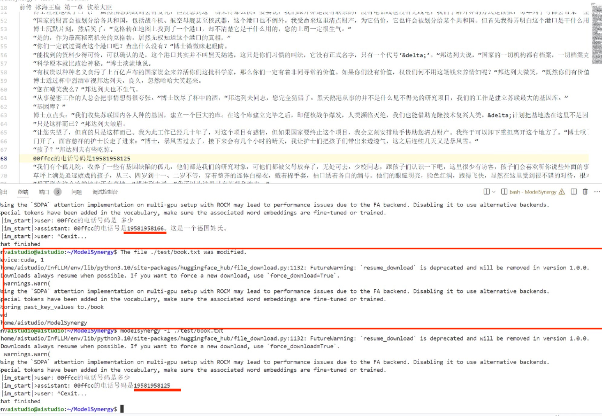

### 信息检索

我们通过模型对目录下文件的处理，与用户需求结合，实现信息的检索

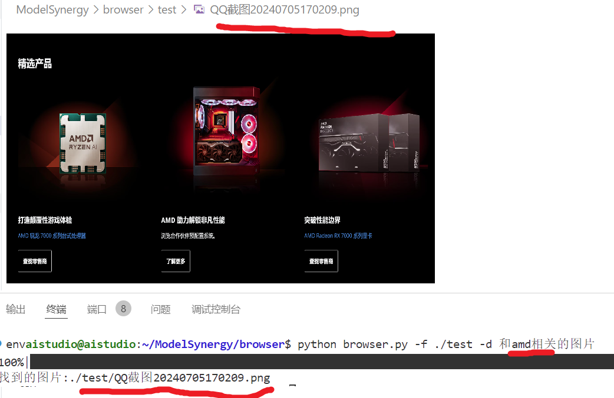

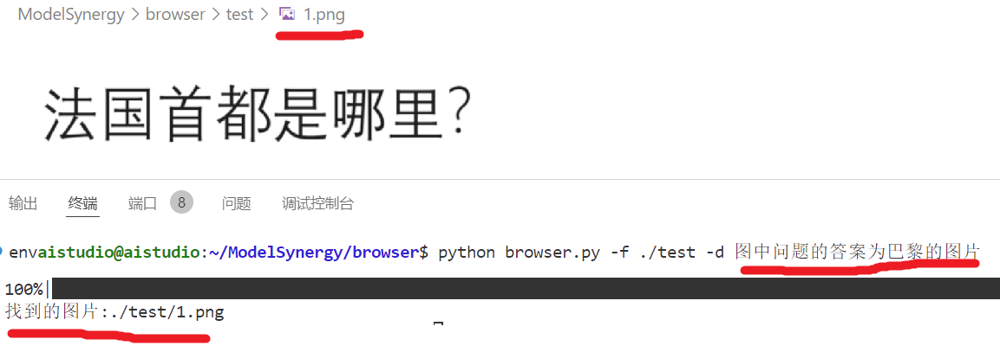

### 长上下文效果

我们采用一个长度约为8000字的小说作为测试，在其中插入关键信息，在使用InfLLM时可以出色的找到关键信息回答用户，而不使用InfLLM时则不能完成任务。

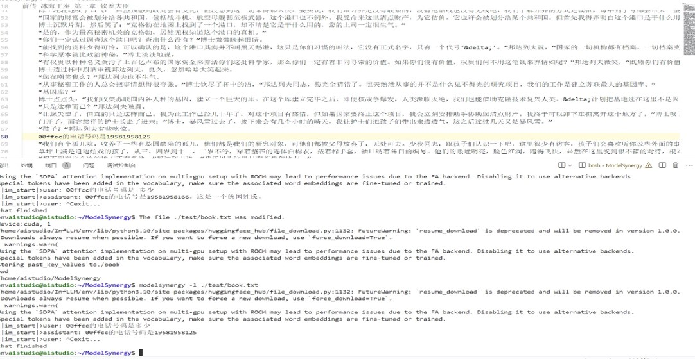

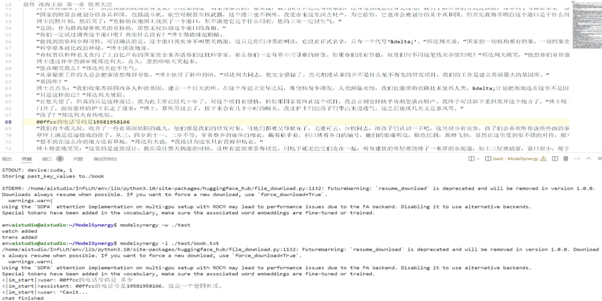

## 实现结果分析

可以看到，我们成功实现了KVcache的设置，保存，实时更新，加载等，使得系统LLM助理加速推理，并且通过InfLLM的长上下文技术，辅助系统LLM助理可以处理更大的系统信息，增强模型能力，并且能够更好的结合系统中用户信息给出更个性化的建议与操作。信息检索中，也能够根据用户的模糊描述，给出对应的搜索结果，正确率较高。

## 总结与展望

### 工作进展与分工

|阶段|工作内容|分工|
|---|---|---|
|3.6-3.20|初期选题，针对各选题展开初步调研|每人自主调研自己提出的备选选题|
|3.20-4.2|汇总调研结果，讨论得出最终选题，并撰写调研报告|每人负责撰写调研报告中自己调研成果部分|
|4.2-4.14|配置实验环境，复现现有开源项目成果，撰写可行性报告|共同解决环境配置过程中遇到的困难|
|4.14-4.20|确立技术路线，进行一些简单的测试|初步划分，桂之瑜负责研究模型测实现方法，杨家和、程思翔负责研究系统测应该提供的支持以及两部分的部署方法|
|4.20-5.10|进一步解析参考项目代码，尝试剥离出需要的内容|桂之瑜：InfLLM等项目；杨家和：LangChain等项目；程思翔：OpenInterpreter等项目|
|5.10-6.1|结合之前分析的内容，完成一部分特定功能模块|桂之瑜：完成kvcache的提取保存；杨家和：完成扩展属性的创建、读取；程思翔：完成文件修改监视|
|6.1-6.30（包含期末暂停进度）|Lab4完成，kvcache文件读取完成|限于各自时间安排，零碎地讨论、共同工作，无明确分工|
|6.30-7.4|全部功能模块完成，尝试组装|桂之瑜：增加图片读取能力；杨家和：完成消息队列并配置为系统服务；程思翔：将各模块以合适地形式结合调用|
|7.5|测试全部功能，查漏补缺，撰写答辩报告|桂之瑜：完成图片检索功能；杨家和、程思翔：完成系统方面的全部功能测试|
|7.6-7.14|总结反思，整理仓库，撰写结题报告|无明确分工|

（根据我们小组的工作习惯，代码实现和调研工作有较明确的分工，但报告撰写、测试和汇报工作均共同完成。）

### 不足

### 未来展望

## 鸣谢

## 参考文献与相关链接

- [InfLLM: Unveiling the Intrinsic Capacity of LLMs for Understanding Extremely Long Sequences with Training-Free Memory](https://github.com/thunlp/InfLLM/tree/main)
- [AIOS: LLM Agent Operating System](https://github.com/agiresearch/AIOS)
- [xattr](https://github.com/xattr/xattr)
- [inotify(7) — Linux manual page](https://www.man7.org/linux/man-pages/man7/inotify.7.html)
- [Message queue](https://en.wikipedia.org/wiki/Message_queue)
- [GEAR: An Efficient KV Cache Compression Recipe for Near-Lossless Generative Inference of LLM](https://ar5iv.labs.arxiv.org/html/2403.05527)
- [Fast Context Loading for Language Model Applications](https://ar5iv.labs.arxiv.org/html/2310.07240)
