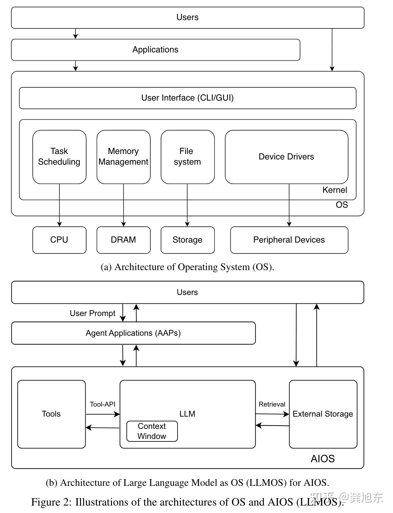
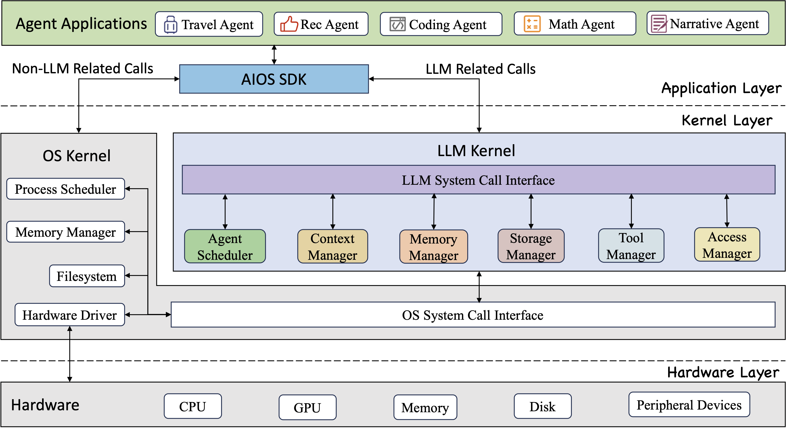
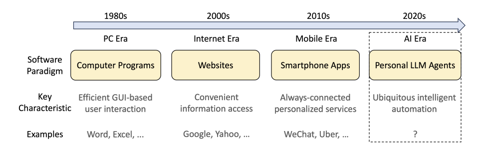

# 调研报告

## 基于大模型(LLM)的操作系统助理

- [调研报告](#调研报告)
  - [基于大模型(LLM)的操作系统助理](#基于大模型llm的操作系统助理)
    - [组员](#组员)
    - [项目概述](#项目概述)
    - [项目背景](#项目背景)
      - [操作系统的交互性发展](#操作系统的交互性发展)
      - [个人LLM助理](#个人llm助理)
    - [立项依据](#立项依据)
      - [Agent于操作系统](#agent于操作系统)
      - [快照技术](#快照技术)
    - [前瞻性/重要性分析](#前瞻性重要性分析)
    - [相关工作](#相关工作)
      - [Open-interpreter](#open-interpreter)
      - [Memgpt](#memgpt)
      - [AIOS](#aios)
    - [参考文献](#参考文献)

### 组员

**程思翔**
**桂之瑜**
**杨家和**

### 项目概述
---

基于`open-interpreter`，结合`Memgpt`，通过多种方向，例如上下文扩展、危险操作快照，将LLM作为Agent引入操作系统，增强操作系统的用户友好性，使得操作系统更加自动化、智能化

### 项目背景
---

#### 操作系统的交互性发展

自计算机诞生以来，操作系统的人机交互性也不断更新发展：

1. **个人计算机的出现（1970年代末）**：随着个人计算机（PC）的诞生，人机交互开始向普通消费者扩展。最初的交互依然依赖于命令行界面，用户需通过键入指令来操作计算机。

2. **图形用户界面的发展（1980年代）**：图形用户界面（GUI）的出现是人机交互历史上的一个里程碑，它提供了更直观的操作方式，用户可以通过视觉图标和指针进行交互，大大提升了计算机的易用性。。

3. **移动互联网时代（2000年代初至今）**：智能手机和平板电脑的流行带来了触摸屏技术的广泛应用。这种直接触摸屏幕的操作方式进一步简化了人机交互过程，并且适应了移动设备便携、随时可用的特点。

4. **未来趋势**：未来的人机交互预计将更加自由、智能和自然。随着人工智能、机器学习和神经网络技术的进步，将LLM引入操作系统，进一步提高人机交互已成为新的趋势

最近，由Andrej Karpathy提出的**LLM OS**提供了一种将LLM引入操作系统的新思路

AIOS则提出了一种将`Agent`类比为app，LLM类比为`OS kernel`的新系统

由此，我们小组成员，提出了上层基于`LLM`的自然语言理解能力，提高与用户的交互，底层基于`open-interpreter`等代码解释器，能够调用系统资源，基于系统当前状态与数据，自动化完成一些列系统任务，达成用户的预期目的。

#### 个人LLM助理
我们将个人LLM助理定义为一种特殊类型的基于LLM的助理，它与个人数据、个人设备和个人服务深度集成。个人LLM助理的主要目的是协助最终用户，帮助他们减少重复和繁琐的工作，并更多地关注有趣和重要的事务。按照这个定义，通用的自动化方法（提示、计划、自我反思等）类似于普通的基于LLM的助理。我们专注于与“个人”部分相关的方面，例如个人数据的管理、智能手机应用程序的使用、部署到资源有限的个人设备等。我们设想个人LLM代理将成为LLM时代个人设备的主要软件范式。
个人助理其实并不是一个新概念。智能手机上的AI助理，比如Siri、小爱、小艺就是上一代（目前应用）的个人助理。它们可以通过语音或者文本输入，理解使用者的部分需求，并有限地调用应用程序和操作系统完成一些简单的指令，比如定个闹钟。然而，目前个人助理能执行的操作极为有限，对于浩如烟海的APP，它能做的往往只有“打开XX APP”。而在PC端，由于操作系统的复杂性和存储的庞大性等原因，更是尚未出现实用AI个人助理。新一代个人LLM助理，就是试图部署LLM来大幅提升个人助理的能力。

将个人LLM助理类比为程序、网页和APP也许并不恰当，但如果个人LLM助理确实能如同设想一样，从自然语言中获取指令，完成当前要在程序、网页和APP上经过繁琐的操作才能完成的操作，那么它带来的冲击将远超这三者。但是，个人LLM助理的软件堆栈和生态系统仍处于非常早期的阶段，相关领域的技术也还无法支持构建如此规模的项目。

与操作系统类似，个人LLM助理同样是需要关联存储、I/O设备、软件、用户交互等各个领域的综合技术。因此，个人LLM助理不仅对LLM的文本理解、代码生成、决策等“本职工作”提出了更高的要求，而且涉及到一些LLM并没有针对性训练的能力，比如GUI理解、多模态呈现、任务调度、上下文选取、管理和利用内存等等。换一个角度来说，也许智能个人助理并不只是需要LLM，而是需要一种有着超强的学习、交互、处理、决策能力的新一代人工智能，只不过目前LLM比较有这种潜力。

### 立项依据
---

#### Agent于操作系统

Agent（智能体）是一种在特定环境中能够自主行动、感知环境、做出决策并与其他Agent或人类进行交互的计算机程序或实体。它们通常具备自主性、反应性、社交性和适应性等特点，旨在根据环境变化调整自身行为，以实现预设目标。

1. **接收输入**：Agent通过所谓的“提示词”（Prompt）接收初始输入，这些提示词定义了Agent需要完成的任务或解决的问题。
2. **理解与识别**：Agent利用内置的语言模型（如LLM大模型）对输入进行处理，理解任务需求和背景信息。
3. **知识库匹配**：根据接收到的信息，Agent会在其知识库中寻找匹配的信息，以便为即将执行的任务做规划。
4. **任务规划**：Agent会规划如何执行任务，这可能包括确定行动步骤、资源分配和时间管理等方面。
5. **行动执行**：最后，Agent将执行规划好的任务，并根据实际结果调整其行为模式，以确保目标达成。

在操作系统中，Agent的输入既包含用户的需求，也包含系统本身的进程信息、硬件设备的使用信息、文件系统，可以综合地辅助用户自动化地执行任务。

#### 快照技术

快照技术是**记录某一时间系统状态的技术**。

快照技术是一种重要的数据保护手段，它能够在特定时间点保存系统的状态，包括操作系统、文件系统以及存储上的数据。这种技术在数据恢复、备份、迁移等操作中有着广泛的应用。例如，当存储设备发生故障或者数据损坏时，可以借助快照技术将数据恢复到之前某个无故障状态的时间点。

快照技术的工作原理主要基于**几种不同的实现方式，如完整复制（Clone）、镜像分割（Split Mirror）以及写时拷贝（COW）和写重定向（ROW）等**。

- **完整复制**： 完整复制是在没有写入操作的时候对数据进行完全复制，以保证数据的一致性。
- **镜像分割**：镜像分割则是创建原始卷的一个镜像，然后在每次写入时同时更新原始卷和镜像卷；当需要快照时，镜像卷能够迅速分离出来形成快照。
- **写时拷贝**：写时拷贝技术在原始数据发生更改时会先复制一份原始数据，然后在复制的数据上进行修改，以此保持快照的原始状态。
- **写重定向**写重定向则是当数据需要更改时，将写操作重定向到新的位置，而不是直接覆盖原有数据，从而保留原始数据直到被明确删除或覆盖。

其中主要的两种：写时拷贝（COW）和写重定向（ROW）。

- **写时拷贝（COW）**：在创建快照后，如果源卷的数据发生变化，系统会先将原始数据复制到快照卷上对应的数据块中，然后才对源卷进行修改。这种方式确保了快照卷保留了创建快照时的原始状态。
- **写重定向（ROW）**：在这种方式下，当数据需要更改时，写操作会被重定向到新的位置，而不是覆盖原有数据。这样，原始数据得以保留，直到被明确地删除或覆盖。

快照技术通过这些方法，为数据提供了一层保护，使得在发生数据丢失或损坏时，能够迅速恢复到特定时间点的状态。这对于维护数据的完整性和可用性至关重要。

### 前瞻性/重要性分析
---

上图是open-interpreter中项目对自身工作方向的描述，与我们的初衷不谋而合。LLM具备超强的语言理解与生活能力，天然就具备成为新一代人机交互界面的潜力。个人LLM助理已经成为许多设备/系统/软件厂商所密切关注的全新领域。也许在AI技术及应用飞速发展下，不久后我们就能见到语音输入设备与LLM交互界面全面取代现有的人机交互设备与图形化界面，仿若科幻小说中的场景。
不过个人LLM助理尚且有许多难题未得到解决。比如，现有的大量应用程序都是通过图形化界面进行操作，而LLM理解图形化界面的能力十分欠缺。我们的这个项目，实际上是基于LLM的代码能力构建简单的个人助理，其中LLM对系统和文件进行的一切操作都是理论上可以完全由命令行处理的，因此避开了图形化界面的难题，但也与真正设想的个人助理有了本质差异。

另一个相关的极具前景的领域是背景介绍中提到的AIOS。与个人助理类似，业界许多人也对AI颠覆性优化现有操作系统这一想法十分看好。在AIOS的框架中，“用AI来学习普通操作系统的行为”是一个重要思想。而目前的个人助理想法，实则也可理解为“用AI来学习程序员操作系统的行为”。显然，这二者紧密关联，一通百通。这一研究方向的最终形态，或许就是AI不断学习用户的使用习惯，为每一个用户“定制”出最顺手的操作系统。不过，AIOS的难度更甚于个人助理，或许还需要非常多的工作与重要的AI技术突破，才能实现。

尽管人工智能助手旨在提高效率和准确性，但它们也可能犯错。自动备份可以在人工智能助手执行错误操作后，允许用户恢复到错误发生前的状态。人工智能助手可能会执行复杂的任务，这有时可能导致系统不稳定。定期的备份可以在系统出现问题时提供恢复点，帮助用户回到一个稳定的状态，减少因系统崩溃而造成的工作中断。

### 相关工作
---

#### Open-interpreter
*[github-open-interpreter](https://github.com/OpenInterpreter/open-interpreter)*

**Open Interpreter是一个强大的开源多语言代码解释器，具有众多功能和优势**

`Open Interpreter`（开放解释器） 可以让大语言模型（LLMs）在本地运行代码（比如 Python、JavaScript、Shell 等）。安装后，在终端上运行 `$ interpreter` 即可通过类似 ChatGPT 的界面与 Open Interpreter 聊天。

其核心特点包括：

- **开源自由**：用户可以自由地获取、修改和分享Open Interpreter的代码。
- **本地执行**：该解释器在用户的本地环境中运行，这意味着它无需依赖互联网访问，可以使用用户计算机上的任何软件包或库。
- **灵活性高**：Open Interpreter没有对文件大小或执行时间的限制，且支持多种编程语言，包括Python、JavaScript、Shell等。
- **模型支持**：它支持联网操作，并且可以与GPT-4, GPT-3.5, CodeLlama等大型语言模型进行交互。

此外，由于Open Interpreter能够完全访问互联网和用户计算机的文件系统，它还可以通过安装新的库和模型来扩展其功能。这使得它在处理大型数据集、进行复杂计算或执行需要大量资源的任务时特别有用。

该软件为计算机的通用功能提供了一个自然语言界面，比如：

> 创建和编辑照片、视频、PDF 等
> 控制 Chrome 浏览器进行搜索
> 绘制、清理和分析大型数据集
> ...

#### Memgpt
*[github-Memgpt](https://github.com/cpacker/MemGPT)*

Memory-GPT（或简称 MemGPT）是一个智能管理 LLM 中不同记忆层（memory tiers）的系统，以便在 LLM 的有限上下文窗口内有效地提供扩展上下文。例如，MemGPT 知道何时将关键信息推送到vector database以及何时在聊天中稍后检索它，从而实现永久对话。

**基于Memgpt，可以有效解决上层LLM上下文有限，难于与系统交互的问题**

MemGPT的主要贡献在于其独特的虚拟上下文管理技术（virtual context management）。这种技术从传统操作系统中的分层（paging）内存系统中获得灵感，通过在快速和慢速记忆（fast and slow memory）之间移动数据，为LLMs提供了无限的memory资源的外观。此外，MemGPT还引入了中断机制，这一机制改变了与用户的交互方式，使其能够更加灵活地管理控制流。具体如下：

**1. 虚拟上下文管理**：

**1.1 分层记忆系统**：MemGPT采用了一个分层的记忆管理系统，模仿了传统操作系统中的内存管理。内部存储分为主上下文（main context）和外部上下文（external context）。前者面向LLM直接访问，后者用于完整历史的存儲。主上下文又细分为系统指令、对话内容和工作内容三部分。
>**系统指令（system instructions）**：是只读的，并且在MemGPT代理程序的生命周期内保持不变。
>**对话上下文（conversational context）**：是只读的，并且有一个特殊的剔除策略（如果队列达到一定大小，会通过递归摘要（recursive summarization）来截断或压缩部分前端）。
>**工作上下文（working context）**：可以通过函数调用由LLM处理器进行写入。

**1.2 动态数据迁移**：这是MemGPT的核心机制。简言之，系统让LLM可以自主地在主上下文和外部上下文之间移动数据,而无需外部干预。

**2. 智能中断机制**：在传统的计算机系统中，中断是一种机制，允许硬件或软件暂停当前执行的任务，以便处理更紧迫或更重要的事情。借鉴这一概念，MemGPT在用户与模型的交互中引入了“智能中断”。

>**用户指令中断**：在与MemGPT的交互过程中，用户可以发送特定的指令来改变会话的方向或请求特定的上下文信息。例如，用户可能希望模型回顾之前的某个主题，或者暂时忽略某些信息。

>**上下文切换**：当用户发出中断指令时，MemGPT需要快速地调整其当前的上下文，以便满足用户的新请求。这就是所谓的“上下文切换”。

>**中断优先级**：不是所有的中断指令都有相同的优先级。有些请求可能比其他请求更紧迫或更重要。MemGPT通过为每个中断指令分配一个优先级来管理这些请求。

**3. 扩展的上下文窗口技术**：
上下文窗口分段：为了更高效地处理超出其原始上下文窗口的信息，MemGPT将长上下文分段，并在需要时动态地加载它们。
优先级排序：MemGPT为上下文中的每一部分分配了一个优先级，基于其与当前交互的相关性。这确保了最相关的信息始终处于快速记忆中，并随时可供访问。
通过以上的方法，MemGPT成功地扩展了LLM的上下文窗口，同时提供了与用户更为灵活和高效的交互方式。

#### AIOS
*[github-AIOS](https://github.com/agiresearch/AIOS)*
AIOS是一个大型语言模型（LLM）代理操作系统，它将大型语言模型嵌入到操作系统（OS）中，作为操作系统的大脑，使操作系统“有灵魂”，这是迈向AGI的重要一步。AIOS 旨在优化资源分配，促进跨代理的上下文切换，实现代理的并发执行，为代理提供工具服务，维护代理的访问控制，并为 LLM 代理开发人员提供丰富的工具包。

### 参考文献
---

1. [Open Interpreter](https://github.com/OpenInterpreter/open-interpreter)

2. [Personal LLM Agents: Insights and Survey about the Capability, Efficiency and Security](https://arxiv.org/abs/2401.05459)

3. [AIOS: LLM Agent Operating System](https://github.com/agiresearch/AIOS)

4. [MemGPT allows you to build LLM agents with self-editing memory](https://memgpt.readme.io/docs/local_llm)

