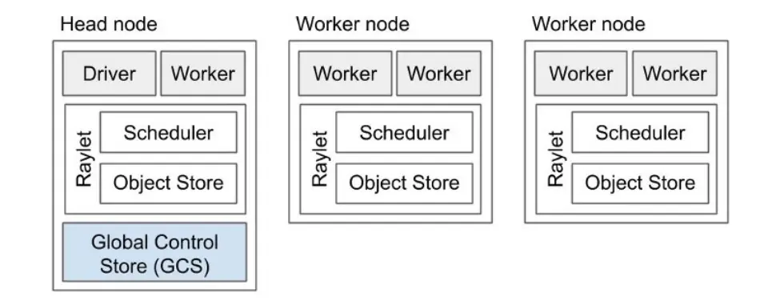

# 分布式计算/存储系统

## Ray

为保护系统python环境**使用`source bin/activate`激活`venv`环境**
`source deactivate`退出`venv`环境

### 部署

1. 使用`ray`支持的`python`版本：3.6-3.9 以python3.9为例
2. `python3.9 -m pip install --upgrade pip`
3. `pip install --upgrade pip` 升级pip，确保支持ray
4. `pip install ray[default]` 获取ray包
> `pip install ray opencv-python` 一个opencv图像处理库

### start

1. 使用`ray start --head`启动一个**ray头节点**
> --port可以指定端口，例如：`ray start --head --port=6379
2. 在其他机器上使用`ray start --address=<head_node_address> --num-cpus=<cpu_num>`向已启动的头节点**添加工作节点**，并且指定该工作节点可使用的CPU数量
> 分配CPU数量的意思是指为一个工作节点分配2个CPU的计算资源，即可并行执行两个任务，ray可能会使用操作系统的线程调度功能来在CPU上并行执行多个任务

`ray status` 查看ray集群当前状态
`ray stop` 结束当前机器ray节点运行

### ray 

1. ray 的节点结构

### Dashboard

在浏览器下打开`head`节点对应的ip，即可打开ray的`Dashboard`界面

## 使用方法

`python3.9 image_init.py`   生成图片测试集
`python3.9 test.py`         串行测试
`python3.9 process_image.py`ray并行测试