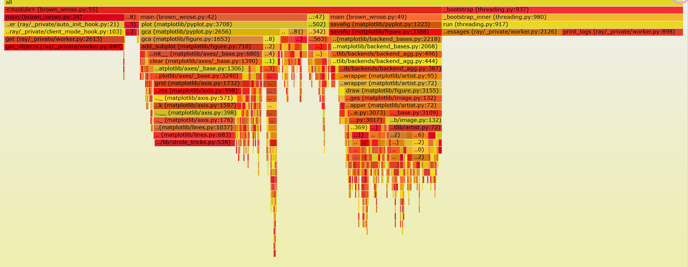
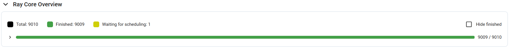
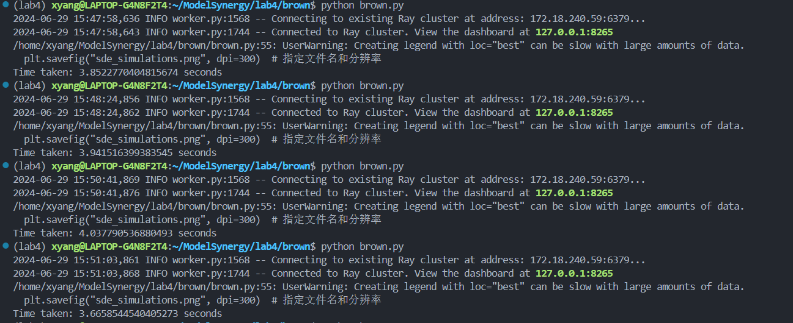
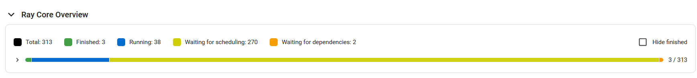
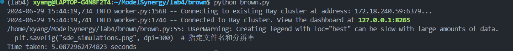

# 用RAY计算求解随机微分方程

- [用RAY计算求解随机微分方程](#用ray计算求解随机微分方程)
  - [随机微分方程与伊藤积分](#随机微分方程与伊藤积分)
    - [具体任务](#具体任务)
    - [利用RAY模拟求数值解](#利用ray模拟求数值解)
  - [部署RAY](#部署ray)
    - [单机部署](#单机部署)
      - [部署运行](#部署运行)
      - [单机部署优化](#单机部署优化)
    - [DOCKER部署RAY](#docker部署ray)
      - [使用说明](#使用说明)
      - [Dockerfile](#dockerfile)
      - [docker-compose](#docker-compose)
  - [性能测试](#性能测试)
    - [性能指标](#性能指标)
    - [单机部署](#单机部署-1)
      - [优化分析](#优化分析)
    - [Docker部署](#docker部署)


## 随机微分方程与伊藤积分

- 随机微分方程是描述随机过程的微分方程，其形式通常为：

\[ dX_t = \mu(X_t, t) dt + \sigma(X_t, t) dW_t \]

这里，
- \( X_t \) 是随时间 \( t \) 变化的随机过程，
- \( \mu(X_t, t) \) 是漂移系数，描述了确定性部分，
- \( \sigma(X_t, t) \) 是扩散系数，描述了随机波动部分，
- \( W_t \) 是维纳过程（或布朗运动），表示随机扰动。

SDE的解通常是一个随机过程，它可以用来描述系统在随机环境下的演化。

- 伊藤积分是为了处理随机微分方程中的随机扰动项 \( dW_t \) 而引入的。与传统的黎曼积分不同，伊藤积分处理的是非确定性的积分。

对于给定的适应过程 \( f(t, \omega) \)，其关于维纳过程 \( W_t \) 的伊藤积分定义为：

\[ \int_0^t f(s, \omega) dW_s \]


### 具体任务

随机微分方程 (SDE) :

$$
dA(t) = \sigma \, A(t) \, dW_t
$$
通常被称为**几何布朗运动** (Geometric Brownian Motion, GBM)。其中`Wt`是标准布朗运动

其可用于：
- **工程与控制系统**
- **时间序列分析**
- **强化学习**

对于方程 \( dA(t) = \sigma A(t) dW_t \)，解的形式为：
\[ A(t) = A(0) \exp\left( \sigma W_t - \frac{1}{2} \sigma^2 t \right) \]
其中 \( A(0) \) 是初始值，\( W_t \) 是标准布朗运动。

这种解法揭示了几何布朗运动中指数增长或衰减的性质.

### 利用RAY模拟求数值解

求解该随机微分方程，可以采用循环累加的方式，将
$$
\int_0^T \sigma \, X(t) \, dW_t
$$
的`T`拆分为`dt`，本次实验中`dt = 1 000 000`

- 用`numpy.random.normal(0, numpy.sprt(dt))`模拟布朗运动的正态增量，由其增量独立性，可并行的进行

## 部署RAY

首先部署一个虚拟环境`venv`

```bash
python3 -m venv venv
```

会生成一个名为`venv`的文件夹，在该文件夹下可进入虚拟环境

- 在`venv`虚拟环境下部署，`venv`可以提供一个轻量化的虚拟环境，与系统的`python`环境隔离(以免系统python环境不支持ray)
  1. **使用`source bin/activate`激活`venv`环境**
  2. `source deactivate`退出`venv`环境 
- `ray`的部署：
  1. 使用`ray`支持的`python`版本：3.6-3.9 以python3.9为例
  2. `python3.9 -m pip install --upgrade pip`
  3. `pip install --upgrade pip` 升级pip，确保支持ray
  4. `pip install ray[default]` 获取ray包

### 单机部署

1. 使用`ray start --head`启动一个**ray头节点**
> --port可以指定端口，例如：`ray start --head --port=6379
1. 在本地机器上使用`ray start --address=<head_node_address> --num-cpus=<cpu_num>`向已启动的头节点**添加工作节点**，并且指定该工作节点可使用的CPU数量
> 分配CPU数量的意思是指为一个工作节点分配2个CPU的计算资源，即可并行执行两个任务，ray可能会使用操作系统的线程调度功能来在CPU上并行执行多个任务

`ray status` 查看ray集群当前状态
`ray stop` 结束当前机器ray节点运行

#### 部署运行

```python
@ray.remote
def brownian_increment(dt):
    # 生成布朗运动增量
    return np.random.normal(0, np.sqrt(dt))

@ray.remote
def solve_sde(sigma, A0, dt, T, num_steps):
    A = np.zeros(num_steps + 1)
    A[0] = A0
    for i in range(1, num_steps + 1):
        A[i] = A[i-1] + sigma * A[i-1] * ray.get(brownian_increment.remote(dt))
    return A
```

将每个增量分布式生成，并且集中叠加

经过测试，这种方法因为任务划分太细，导致分布式处理时网络通信压力较大，并且由于通信带来的内存压力极大的限制了分布式处理的性能，并不能体现出`ray`分布式计算的优化

#### 单机部署优化

1. **内部拆分**

- 分批：由于布朗运行具有独立增量性，在生成`dt`时间内增量时，每个增量服从独立的正态分布，可以分布式处理，当划分粒度为`1000000`时，若一次性生成会造成极大的内存开销，并且不利于将任务并行化，故采用分批的方式，多次生成，批处理大小经测试，在批处理大小为`200000`时与`10000`时性能较好，但批处理大小过大可能会造成单个节点内存开销过大
- 分步：将每次解`SDE`的过程分为：增量的生成，增量的累加。分成两步，并行进行

```python
@ray.remote
def brownian_increment(num_steps, dt, batch_size):
    # 一次性生成多个时间步骤的增量
    num_batches = num_steps // batch_size
    increments = [np.random.normal(0, np.sqrt(dt), size=batch_size) for _ in range(num_batches)]
    return np.concatenate(increments)
```

```python
@ray.remote
def solve_sde(sigma, A0, dt, T, num_steps, batch_size):
    A = np.zeros(num_steps)
    A[0] = A0
    num_batches = num_steps // batch_size
    increments = ray.get([brownian_increment.remote(batch_size, dt, batch_size) for _ in range(num_batches)])
    increments = np.concatenate(increments)[:num_steps-1]  # 确保增量数组与时间步骤对齐
    for i in range(1, num_steps):
        A[i] = A[i-1] + sigma * A[i-1] * increments[i-1]
    return A
```

2. **外部拆分**

- 由于求解该随机微分方程，其解具有随机性，故模拟10次并画出其图像来对比，每一次都可并行，划分为10个任务

```python
sigma = 0.2
A0 = 1.0
T = 1.0
num_steps = 1000000
batch_size = num_steps // 5 # 批处理大小
dt = T / num_steps

futures = [solve_sde.remote(sigma, A0, dt, T, num_steps, batch_size) for _ in range(10)]
```

### DOCKER部署RAY

#### 使用说明

- 目录结构
```bash
.                     // docker目录
├── ray               // ray测试代码目录
│   ├── brown.py      // 测试代码
├── .dockerignore
├── compose.yaml      // 容器创建文件
├── Dockerfile        // 镜像创建文件
└── README.md
```
- 创建镜像：
  - `docker build --build-arg BASE_IMAGE=2.5.0 -t rayproject/ray:latest .`
    - 其中`BASE_IMAGE`用于指定构建Docker镜像时的基础镜像版本号，例如此次实验为`rayproject/ray:2.5.0`故BASE_IMAGE=2.5.0(当然也可以直接修改dockerfile不用该参数)
    - `docker build [OPTIONS] PATH | URL | -`为docker build命令的使用方法，`.`为使用当下目录下的Dockerfile
    - `PATH | URL | -`：指定Dockerfile所在的路径、一个Git仓库的URL，或者通过-来指示Docker读取标准输入作为Dockerfile的内容。
- 创建容器与ray集群
  - `docker-compose -f compose.yaml up -d`
    - 其中，`-f`用于指定`.yml`文件的名称
    - `-d`表示这些容器在后台运行
- 移除这些容器
  - `docker-compose -f compose.yaml down`
- 连接到ray集群并执行测试
  - `docker exec -it ray-head bash`连接到头节点并进入头节点的bash
  - `python brown.py`执行测试程序


#### Dockerfile

**Dockerfile规定了镜像`image`的环境构成规则与镜像生成中的操作**
- 工作目录设置为容器下的`/ray`目录
- 将所需要的任务代码copy至工作目录
- 安装所需要的依赖

```dockerfile
ARG BASE_IMAGE
ARG FULL_BASE_IMAGE=rayproject/ray:"$BASE_IMAGE"
FROM $FULL_BASE_IMAGE

WORKDIR /ray
# 将ray目录复制到镜像/ray目录下
COPY ./ray .

# 安装matplotlib可能需要的系统依赖（根据需要选择安装）并清理APT缓存
RUN apt-get update && apt-get install -y \
    libfreetype6-dev \
    libpng-dev \
    libx11-dev \
    && rm -rf /var/lib/apt/lists/*

# 安装Python依赖
RUN pip install numpy matplotlib pandas psutil requests
```

#### docker-compose

**docker-compose定义了多个容器如何协作**，这里即多个容器如何形成ray集群
- 分别定义了`ray-head`与`ray-worker-num`容器
- 均使用`rayproject/ray`镜像
- 将这些容器挂载在主机`./ray`目录下

```yml
# Desc: docker-compose的配置文件
# docker-compose是一个用于定义和运行多容器Docker应用程序的工具
# 通过compose.yaml文件，可以配置应用程序的服务、网络、卷等
# 通过docker-compose命令，可以从compose.yaml文件中读取配置，然后创建并启动服务
# compose.yaml文件的版本格式
version: '3.8'

# 服务定义
services:
  # 服务名
  ray-head:
    # 镜像名
    image: rayproject/ray:latest
    # 容器名
    container_name: ray-head
    # 命令
    command: >
      ray start --head --port=6379 --dashboard-host=0.0.0.0
    # 端口映射
    ports:
      # ray头节点端口
      - "6379:6379"
      # dashboard端口
      - "8265:8265"
    # 挂载卷
    volumes:
      - ./ray:/ray
    # 环境变量
    environment:
      - RAY_ADDRESS=ray://ray-head:10001
  ray-worker-1:
    image: rayproject/ray:latest
    container_name: ray-worker-1
    command: >
      ray start --address=ray-head:6379
    volumes:
      - ./ray:/ray
    depends_on:
      - ray-head
```

## 性能测试

### 性能指标

分布式计算任务的性能指标主要有以下几种：


综合考虑对性能的全面分析需求和测试的实践方法，我们主要测试吞吐量、任务完成时间、资源利用率，同时也关注到特定条件下负载分布、任务调度耗时和任务失败情况。

### 单机部署

单机部署性能表如下。结点数为2，性能优化主要通过调整批处理任务量来实现。根据未使用ray、无优化、优化后，以及不同任务量来记录运行时间，单位为秒。

| 任务量 | 10000\*10 | 100000\*10 | 1000000\*10 |
|-|-|-|-|
|未使用Ray| 0.20 | 1.80 | 18.90 |
|无优化| 56.14 | - | - | 
|有优化| 5.14 | 3.03 | 3.79 |

分析表中结果，可知在任务量较小时ray由于节点间调度耗费大量时间，性能无提升；在任务量较大时有明显提升。同时，优化前后也有明显提升（约为992%），并且在任务量较大时无优化的ray架构中划分过于细粒度导致超过负载，无法完成计算任务。

接下来再展示一些DashBoard和时序分布图：


这是10000\*10节点资源利用情况。CPU和内存占用都很均匀，负载情况良好。




这是10000\*10任务量下时序分布图，上图为优化前，下图为优化后。优化后明显时间片分布更加均匀。

#### 优化分析

本任务的优化策略主要集中在调整批处理任务量上。批处理任务量太小时，总任务批次太多，难以调度，可能运行失败；批处理任务量太大时，单个节点内存负载大。因此，针对1000000\*10的计算任务，调整不同的批处理任务量，进行了多次测试，结果如下：

- 批处理任务量为1000时，调度失败：
  

- 批处理任务量为10000时，表现良好，因此进行了多次测试，展示部分结果：
  

- 批处理任务量为20000时：
  
  
  有大量任务等待调度，这说明在当前条件下任务调度耗时成为了重要的性能限制因素。

- 批处理任务量为100000时：
  

- 批处理任务量为200000时，表现良好，因此进行了多次测试，展示结果：
  
  

数据汇总处理后，发现批处理任务量为10000和200000时性能较好，前者平均用时为3.99s，后者为3.79s。

### Docker部署