# 性能测试

## 性能指标

分布式计算任务的性能指标主要有以下几种：

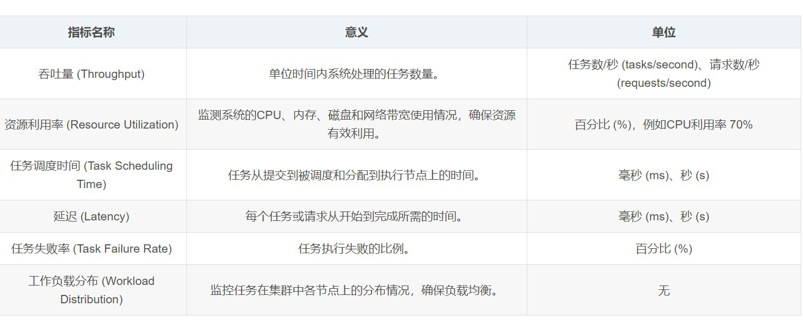

综合考虑对性能的全面分析需求和测试的实践方法，我们主要测试吞吐量、任务完成时间、资源利用率，同时也关注到特定条件下负载分布、任务调度耗时和任务失败情况。

## 单机部署

单机部署性能表如下。结点数为2，性能优化主要通过调整批处理任务量来实现。根据未使用ray、无优化、优化后，以及不同任务量来记录运行时间，单位为秒。

| 任务量 | 10000\*10 | 100000\*10 | 1000000\*10 |
|-|-|-|-|
|未使用Ray| 0.20 | 1.80 | 18.90 |
|无优化| 56.14 | - | - | 
|有优化| 5.14 | 3.03 | 3.79 |

分析表中结果，可知在任务量较小时ray由于节点间调度耗费大量时间，性能无提升；在任务量较大时有明显提升。同时，优化前后也有明显提升（约为992%），并且在任务量较大时无优化的ray架构中划分过于细粒度导致超过负载，无法完成计算任务。

接下来再展示一些DashBoard和时序分布图：

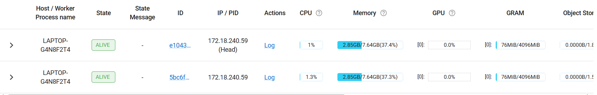

这是10000\*10节点资源利用情况。CPU和内存占用都很均匀，负载情况良好。

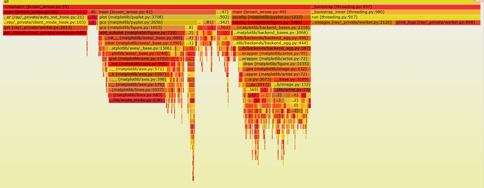

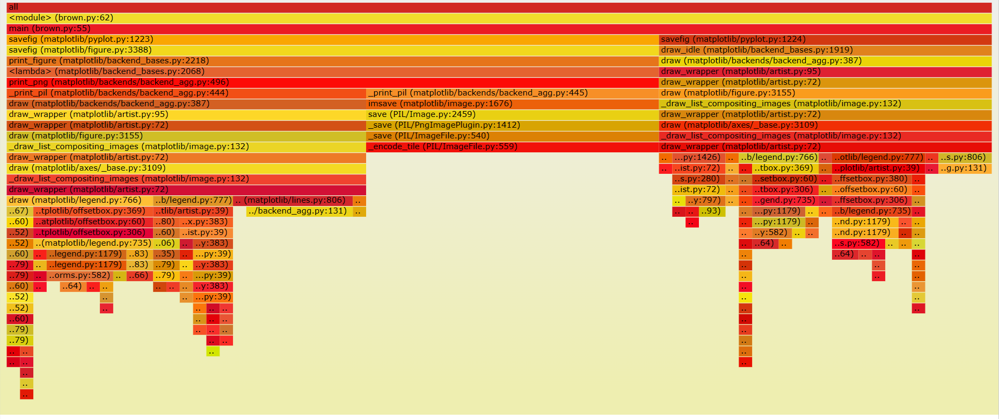

这是10000\*10任务量下时序分布图，上图为优化前，下图为优化后。优化后明显时间片分布更加均匀。

### 优化分析

本任务的优化策略主要集中在调整批处理任务量上。批处理任务量太小时，总任务批次太多，难以调度，可能运行失败；批处理任务量太大时，单个节点内存负载大。因此，针对1000000\*10的计算任务，调整不同的批处理任务量，进行了多次测试，结果如下：

- 批处理任务量为1000时，调度失败：
  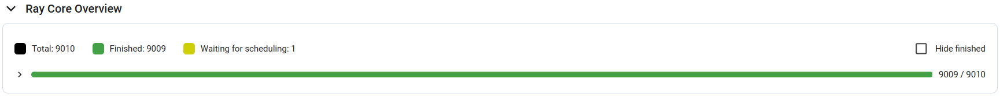

- 批处理任务量为10000时，表现良好，因此进行了多次测试，展示部分结果：
  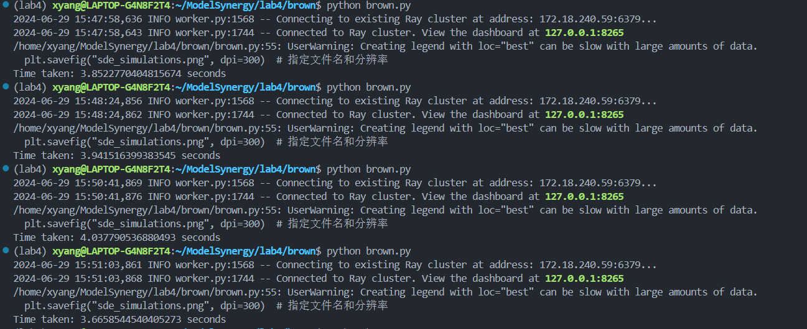

- 批处理任务量为20000时：
  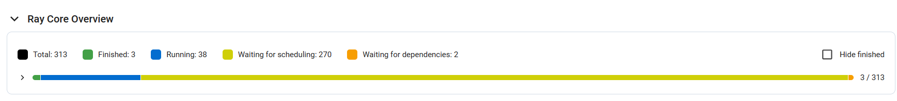
  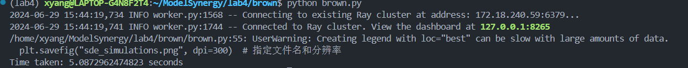
  有大量任务等待调度，这说明在当前条件下任务调度耗时成为了重要的性能限制因素。

- 批处理任务量为100000时：
  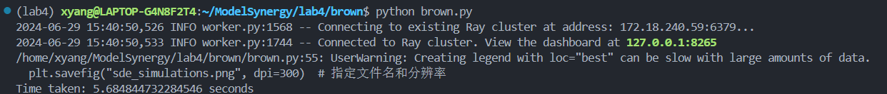

- 批处理任务量为200000时，表现良好，因此进行了多次测试，展示结果：
  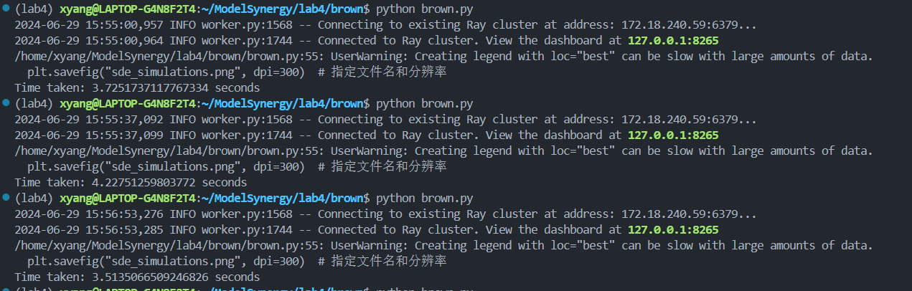
  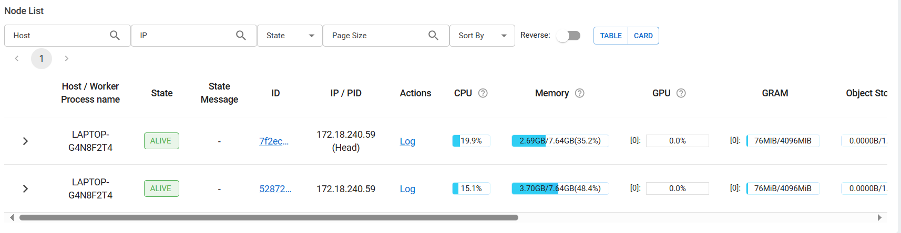

数据汇总处理后，发现批处理任务量为10000和200000时性能较好，前者平均用时为3.99s，后者为3.79s。

## Docker部署

Docker部署双结点测试结果如下：

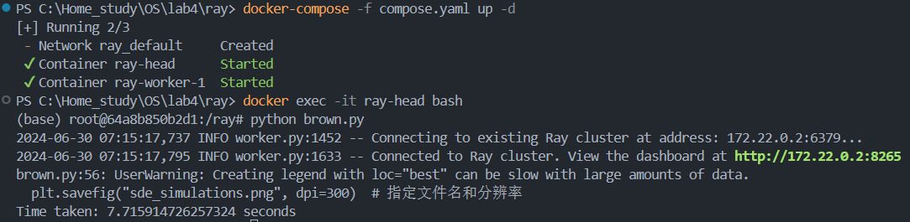

经过分析，发现运行过程中内存占用率过高，明显限制了运行速度。增大Docker内存分配后，可以发现性能有明显提高：

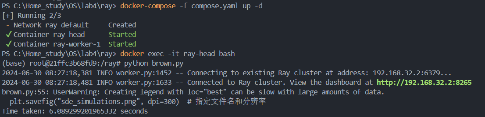

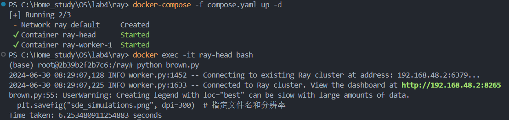

综合比较Docker部署Ray的性能与单机部署的各种情况，可以发现单机优化后的性能最优，Docker部署的性能次之，单机无优化和不实用Ray的性能较差。这可能是结点间通信开销导致的。

## 结论

在适宜的环境下，通过针对性的优化，Ray架构可以明显提高分布式运算任务的性能。

  